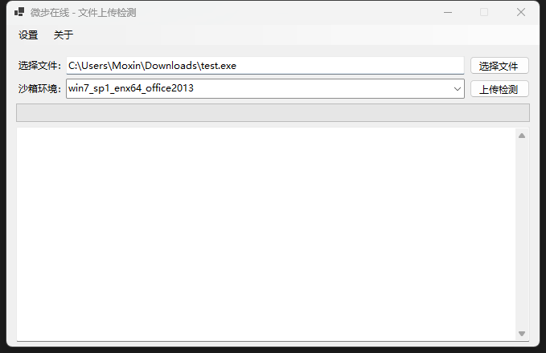

# 关于项目
## 介绍
本项目是基于C#的WinForms制作的一个微步在线沙箱文件上传检测小助手。

## 使用方法

1.在仓库的Release中下载你的系统架构的程序。

2.下载完成后，打开程序。

3.在左上角“设置”选项卡中，选择API设置。

4.在API设置页面中，设置你的微步在线API-Key（API-Key可以从https://x.threatbook.com/v5/serviceCenter?tab=myKey 获得）

5.设置完成后，会在当前目录创建一个x_uploader.ini(**无论如何，建议不要删了它，不然你下次用的时候还得设置**)

6.回到程序首页，选择文件。

7.选择沙箱运行环境，点击上传检测。

